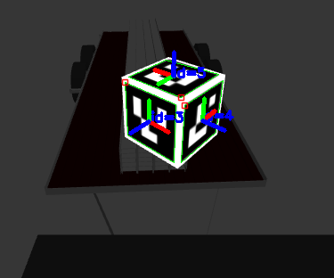

# aruco_cube_ros

## Overview
ROS wrapper for 3D pose estimation of an Aruco Cube using openCV's (3.2) [arcuo module](https://docs.opencv.org/3.2.0/d5/dae/tutorial_aruco_detection.html).

The aruco_cube_ros package has been tested under [ROS] meldoic and Ubuntu 18.04. 

### License

The source code is released under a [BSD 3-Clause license](LICENSE).

## Installation

### Building from Source

To build from source, clone the latest version from this repository into your catkin workspace and compile the package using

	cd catkin_workspace/src
	git clone https://github.com/universal-field-robots/aruco_cube_ros
	cd ../
	catkin_make

## Usage

Run the main node with

	roslaunch aruco_cube_ros aruco_cube_node.launch
  
Or, run as nodelet with

	roslaunch aruco_cube_ros aruco_cube_nodelet.launch

## Config files

config/

* **aruco_cube_params.yaml** configurtaiton of topics/services, aruco marker specific settings and filter options.

## Launch files

* **aruco_cube_node.launch:** Loads parameters define in `aruco_cube_params.yaml` and launches the aruco_cube_ros node.

* **aruco_cube_nodelet.launch:** Loads parameters define in `aruco_cube_params.yaml` and launches the aruco_cube_ros under a  user defined nodelet manager.
    - **`manager_name`** name of nodelet manager. Default: `aruco_manager`.

## Nodes

### aruco_cube

Determines 3D pose of aruco cube from a given image.

#### Subscribed Topics

* **`/rgb/image_raw_color`** ([sensor_msgs/Image])

	Input image used to detect aruco cube.
  
* **`/rgb/camera_info`** ([sensor_msgs/CameraInfo])

	Corresponding camera info topic used to get camera intrinsics.

#### Published Topics

* **`aruc_cube_pose`** ([geometry_msgs/PoseWithCovarianceStamped])

	Pose estimated of aruco cube.

#### Services

* **`get_aruco_pose`** ([aruco_cube_ros/GetPose])

	Returns Pose estimated of aruco cube. For example, you can request the pose by

		rosservice call /aruco_cube/get_aruco_pose

#### Parameters

* **`image_topic`** (string, default: "/rgb/image_raw_color")

	The name of the image input topic.
  
* **`cam_info_topic`** (string, default: "/rgb/camera_info")

  The name of the camera info topic.
  
* **`pose_topic`** (string, default: "aruco_cube_pose")

  The name of output pose estimate topic.

* **`srv_topic`** (string, default: "get_aruco_pose")

  The name of aruco cube pose request service.
  
* **`stream_image_topic`** (bool, default: true)

  Boolean to indicate constant pose estiamte from camera input topic. Set to false, if you only want pose estimate on request via service call.
  
* **`display_opencv_window`** (bool, default: true)

  Boolean to indicate if you wish to display result of detected aruco markers in cvWindow.
  
* **`broadcast_transform`** (bool, default: false)

  Boolean to indicate if you wish to broadcast statc transform between a define parent_link and child_link (aruco_link)
   
* **`parent_frame_id`** (string, default: "base_link")

  name of frame which you wish to broadcast the aruco marker link with respect to. This does no have to be the camera frame, it can be any frame aslong as the transform between the camera and that frame exsist. 
  
* **`child_frame_id`** (string, default: "aruco_cube_link")

  name of frame of aruco link.

* **`window_size`** (int, default: 1, min: 0, max: 200)

	The size of the circular buffer used to estimate the best pose. 
  
* **`covariance`** (vector, default: [0, 0, 0, 0, 0, 0])

  The know covariance of the pose estimation. These correspond to [x, y, z, roll, pitch, yaw]. This is to be determined experimentally if desired. 
  
  
* **`cube_offsets`** (vector<double>, default: [0.0, 0.0, 0.0])

  tbc

* **`marker_side_length`** (double, default: 0.260)

  The side length of the individual marker squares. This excludes the white boarder around each marker.
  
* **`cube_side_length`** (double, default: 0.300)

  The side length of the actually cube. i,.e. marker_side_length + the white boarder.
  
* **`aruco_dictionary_id`** (int, default: 0)

  tbc
  
* **`marker_ids`** (vector<int>, default: 0)

  tbc
  
* **`do_corner_refinement`** (bool, default: true)

  Boolean to indicate where to do corner refinement method.
  
* **`corner_refinement_win_size`** (int, default: 2, min: 0, max: 200)

  Window size of corner refinement method.
  
* **`corner_refinement_max_iterations`** (int, default: 50,  min: 0, max: 200)

  Max interations of corner refinement method.
  
* **`corner_refinement_min_accuracy`** (double, default: 0.9, min: 0, max: 1.0)

  Minimum accuracy required for corner refinement method. Otherwise continues untill 'corner_refinement_max_iterations'. 
  
* **`error_correction_rate`** (double, default: 0.9, min: 0, max: 1.0)

  Error correction rate for corner refinement method.
  
* **`max_erroneous_bits_in_border_rate`** (double, default: 0.6, min: 0, max: 1.0)

  Max erroneous bits that can be in the detectd boarder of the aruco marker during the corner refinement method.

#### Additional Notes

If the paramater `window_size` is set to greater than 2, than a filtered result will be returned. Estimates of the aruco_cube pose are sampled using a moving window of size `window_size`. A gaussian distrubution is applied separately to both the position and orientation information of the poses in the winodw. Results outside of a single std-dev are discarded. The returned pose position and orientaiton is then selected separately based on the follow criteria:
* position: Sample with the minimum sum of sqaure distance to all others positions.
* orientation: sample with minimum sum of [angleShortestPath()](http://docs.ros.org/melodic/api/tf/html/c++/classtf_1_1Quaternion.html#ac3eb8b9304c93866fb45b7bb8cff696e) to all other orientations.
## Bugs & Feature Requests

Please report bugs and request features using the [Issue Tracker](https://github.com/universal-field-robots/aruco_cube_ros/issues).
